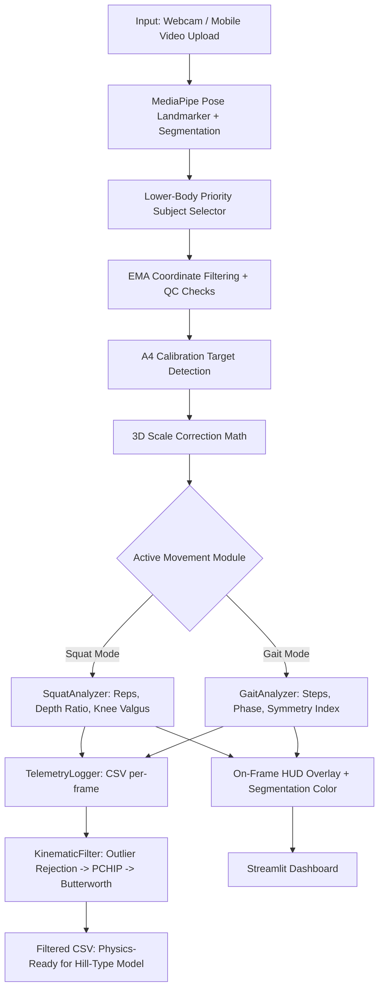

# Workspace State: Home-Based Markerless Movement Analysis Subsystem

This document provides a human-and-AI-readable summary of the current project state, architecture, and workspace configuration to serve as a context handoff.

---

## Project Overview
*   **Subsystem:** Team 5 (Movement Analysis & Tele-Rehabilitation Subsystem)
*   **Purpose:** Ingest patient clinical videos, perform pose estimation, compute biomechanical kinematic features (ROM, joint angles, gait metrics, symmetry), flag compensation patterns, and present results to clinical staff.
*   **Primary Tech Stack:** Python 3.12, [uv](https://docs.astral.sh/uv/), FastAPI, Streamlit, MediaPipe Pose (Tasks API), OpenCV, NumPy, SciPy.
*   **Ultimate Goal:** Raw skeleton landmark extraction → 3D skeleton reconstruction → Hill-Type Muscle Model (force-length-velocity relationships per muscle group).

---

## Key Source Code Mapping

### Entry Points
*   **FastAPI Backend Orchestrator:** `pose-detection/main.py`
    *   Exposes `POST /api/movement/assess` to ingest clinical videos and output structured biomechanical JSON payloads.
*   **Streamlit Interactive App:** `pose-detection/streamlit_app.py`
    *   Two modes: **Live Webcam** (record-to-cache + A4 calibration overlay) and **Upload Video File**.
    *   Runs both SquatAnalyzer + GaitAnalyzer simultaneously per-frame with dual HUD overlay.
    *   Renders segmentation overlay that turns **Orange/Red** when knee valgus is flagged.

### Biomechanical Logic (`pose-detection/src/`)
*   `config.py`: All tunable constants (EMA alpha, MediaPipe thresholds, QC thresholds, A4 calibration params, patient ID).
*   `pipeline.py`: `PoseEstimationPipeline` class — MediaPipe VIDEO mode wrapper, Lower-Body Priority Subject Selector, A4 paper detection, calibration multiplier calculation.
*   `analytics.py`: All biomechanical math:
    *   `calculate_2d_angle` — Simple 2D angle via atan2 (legacy, kept for future use)
    *   `calculate_3d_angle` — 3D vector angle via NumPy dot-product on MediaPipe world landmarks
    *   `calculate_symmetry_index` — SI formula `|L-R|/(0.5*(L+R))*100%` for gait asymmetry flagging
    *   `calculate_valgus_index` — Horizontal knee deviation from hip-ankle line (signed, frontal plane)
    *   `ClinicalTrackingProcessor` — EMA smoothing (alpha=0.25) + occlusion memory hold (up to 6 frames)
    *   `SquatAnalyzer` — Squat rep counter, depth ratio, valgus/varus detection, 3D knee angle tracking
    *   `GaitAnalyzer` — 3D camera-invariant step detection via cross-product forward axis, stance/swing state machine, symmetry index computation
*   `postprocessing.py`: `KinematicFilter` — 3-step post-processing pipeline applied after session ends:
    1. Velocity outlier rejection (removes anatomically-impossible spikes > 5 m/s)
    2. PCHIP interpolation (fills NaN gaps from tracking loss — shape-preserving, no overshoot)
    3. Zero-lag 4th-order Butterworth low-pass filter (6 Hz cutoff, OpenSim standard)
*   `logger.py`: `TelemetryLogger` — Per-frame CSV logger. Auto-saves to `data/sessions/session_{PATIENT_ID}_{timestamp}.csv`.
*   `qc.py`: `get_brightness` — Frame luminosity QC check.

---

## Current Implementation Progress

| Layer | Module | Status | Notes |
|---|---|---|---|
| L1 Sensing | Webcam / Video upload | Done | Webcam records to `data/latest_recording.mp4` |
| L2 Pose Estimation | MediaPipe Pose Landmarker (full) | Done | VIDEO mode, multi-pose, segmentation mask enabled |
| L2 QC | Subject Selection | Done | Lower-body priority (hips/knees/ankles visibility score) |
| L2 QC | Lighting Check | Done | Warns if brightness < 80 or > 220 |
| L2 QC | Occlusion Detection | Done | Red dots + warning text for occluded joints |
| L2 QC | Out-of-Frame Detection | Done | Full-frame "LOWER BODY OUT OF FRAME" warning |
| L3 Feature | EMA Smoothing | Done | alpha=0.25, 6-frame occlusion memory hold |
| L3 Feature | 3D Joint Angle | Done | Vector math on `pose_world_landmarks` |
| L3 Feature | A4 Calibration | Done | minAreaRect contour + shoulder-cross-reference multiplier |
| L4 Analysis | **Squat Biomechanics Module** | Done | See below |
| L4 Analysis | **Gait Cycle and Symmetry Module** | Done | See below |
| L5 Telemetry | CSV Session Logger | Done | Timestamped, all joints + angles + metrics |
| L5 Telemetry | Kinematic Post-Filter | Done | 3-step: Outlier -> PCHIP -> Butterworth |
| L5 Presentation | Streamlit Dashboard | Done | Dual HUD (Squat + Gait), 3D coords table, raw landmarks |

---

## Module Deep-Dives

### Squat Biomechanics Module (SquatAnalyzer)
**File:** `src/analytics.py` -> `class SquatAnalyzer`

**Purpose:** Counts squat repetitions, tracks squat depth, and flags knee valgus (knee cave-in compensation).

**State Machine:**
- `is_squatting = False` (standing up, `avg_ratio > 0.9`)
- `is_squatting = True` (depth detected, `avg_ratio < 0.8`)
- Rep counted when rising back from squat (`avg_ratio > 0.9`)

**Key Math:**

Squat Depth Ratio:
```
ratio = current_hip_ankle_3D_dist / standing_hip_ankle_3D_dist
```
- Ratio < 1.0 -> squatting. Ratio ~0.55 -> deep squat.
- Uses 3D Euclidean distance (hip to ankle) from `pose_world_landmarks` to be camera-angle invariant.
- Standing height updates via EMA (alpha=0.1) if patient stands taller than recorded baseline.

Knee Valgus Index:
```
deviation = knee_x - expected_knee_x_on_hip_ankle_line
```
- Frontal plane (X-Y) projection of knee against the hip-ankle segment.
- Negative = inward (valgus), Positive = outward (varus).
- Left leg: `valgus_flag = deviation < threshold`. Right leg: `valgus_flag = -deviation < threshold`.
- `valgus_threshold = -0.05` (meters) — roughly 5 cm inward deviation triggers the flag.

**Output Dict per frame:**
```python
{
    "reps": int,             # completed squat rep count
    "is_squatting": bool,    # current squat state
    "current_depth": float,  # current ratio (0.0 = full squat, 1.0 = standing)
    "min_depth": float,      # deepest ratio recorded in this rep
    "valgus_l": bool,        # True if left knee is valgus
    "valgus_r": bool,        # True if right knee is valgus
    "valgus_idx_l": float,   # raw signed valgus index in meters
    "valgus_idx_r": float    # raw signed valgus index in meters
}
```

**Visual Feedback:**
- Segmentation overlay color: **Cyan** (normal) -> **Orange/Red** (valgus detected)
- On-frame HUD (top-right black box): SQUATS count, DEPTH ratio, STATE (UP/DOWN)

---

### Gait Cycle and Symmetry Module (GaitAnalyzer)
**File:** `src/analytics.py` -> `class GaitAnalyzer`

**Purpose:** Detects walking steps, classifies stance vs. swing phase, measures stride spread, and calculates leg symmetry index.

**Camera-Invariant Design:**
- Uses 3D cross-product of the pelvis lateral vector (left hip -> right hip) x vertical gravity axis (0,1,0) to compute the patient's true "Forward" direction in 3D space.
- All stride measurements are projected onto this forward axis — accuracy is maintained whether the patient walks **towards**, **away from**, or **across** the camera.

**State Machine:**
- `in_swing = True` when inter-ankle distance > `step_threshold` (0.25 m)
- `in_swing = False` when inter-ankle distance < `stance_threshold` (0.15 m) -> step registered

**Key Math:**

Inter-ankle distance (horizontal plane only, X and Z axes):
```
dist = sqrt((l_ankle_x - r_ankle_x)^2 + (l_ankle_z - r_ankle_z)^2)
```

Leading leg determination:
```
forward_axis = cross(r_hip - l_hip, [0, 1, 0])
l_ext = dot(l_ankle - pelvis_center, forward_axis)
r_ext = dot(r_ankle - pelvis_center, forward_axis)
leading = "L" if l_ext > r_ext else "R"
```

Symmetry Index (SI):
```
SI = |avg_L_stride - avg_R_stride| / (0.5 * (avg_L + avg_R)) * 100%
```
- SI > 10% -> `is_asymmetric = True` flag raised

**Output Dict per frame:**
```python
{
    "step_count": int,           # total steps detected
    "current_step_dist": float,  # current inter-ankle spread (meters)
    "symmetry_index": float,     # SI percentage (0 = perfectly symmetric)
    "is_asymmetric": bool,       # True if SI > 10%
    "phase": str                 # "SWING" or "STANCE"
}
```

**Visual Feedback:**
- On-frame HUD (second black box below Squat HUD): STEPS count, PHASE (SWING/STANCE), SYMMETRY % (green if OK, red if asymmetric)

---

### Telemetry Pipeline (Post-Processing)
**File:** `src/postprocessing.py` -> `class KinematicFilter`

**Design Decision on Interpolation:**
Raw MediaPipe data quality concern was raised — if tracking quality is poor, naive interpolation (linear/spline) can spiral away from ground truth. Our solution is velocity-gated PCHIP:

1. **Velocity Outlier Rejection:** Any coordinate jump > 5 m/s is anatomically impossible. Blanked to NaN before interpolation.
2. **PCHIP (Piecewise Cubic Hermite Interpolating Polynomial):** Shape-preserving, never overshoots between known data points. Does NOT extrapolate past the ends.
3. **Butterworth Low-Pass Filter (6 Hz):** Final noise removal — standard in biomechanics (matches OpenSim pipeline).

Why PCHIP over Spline/Linear:

| Method | Pros | Cons |
|---|---|---|
| Linear | Simple | Sharp corners, misses biological smoothness |
| Cubic Spline | Smooth | Can overshoot significantly at boundaries |
| **PCHIP** | Shape-preserving, monotonic in local segments | Slightly less smooth than spline (acceptable) |

---

## Mathematical Model Notes

### Coordinate System (MediaPipe World Landmarks)
- Origin: mid-point of hip landmarks
- Y-axis: pointing UP (opposite of screen Y)
- X-axis: pointing LEFT (from patient's perspective)
- Z-axis: pointing towards the camera (depth)
- Units: **meters** (before calibration multiplier is applied)

### A4 Calibration Method
- Detect A4 paper contour in frame (297 mm x 210 mm)
- Use `minAreaRect` (not `approxPolyDP`) to handle partial finger occlusion of paper edges
- Calculate `meters_per_pixel` from the paper's pixel height
- Cross-reference with shoulder width in pixels vs. shoulder width from world landmarks
- Apply EMA (alpha=0.1) to smooth multiplier: `new_mult = 0.1 * raw + 0.9 * prev`

### Future Directions: Hill-Type Muscle Model
After skeleton reconstruction, feed joint angles + angular velocities into a Hill-Type muscle model to estimate:
- **Contractile Element (CE):** Force-velocity and force-length relationships for key muscles (Quadriceps, Hamstrings, Gastrocnemius)
- **Passive Element (PE):** Passive elastic tissue contribution at extreme ROM
- **Series Element (SE):** Tendon compliance modeling
- Reference: https://www.sciencedirect.com/topics/engineering/hill-type-muscle-model
- This requires accurate 3D joint angle data — why the calibration and filtering pipeline is being built first.

---

## Execution Guide
1. **FastAPI Backend Server:**
    ```bash
    cd pose-detection
    uv run uvicorn main:app --reload
    ```
2. **Streamlit Dashboard:**
    ```bash
    cd pose-detection
    uv run streamlit run streamlit_app.py
    ```

---

## Recording Guide for Clinical Data

### Ideal Setup for Gait Analysis
- **Camera Height:** Waist height (~1 m from floor), perfectly level (no tilt)
- **Camera Position:** Perpendicular to the walk path (patient walks across the screen left-to-right)
- **Distance:** 3-4 m from patient (full body visible including feet)
- **Lighting:** Uniform ambient light, no strong backlighting, no harsh shadows on legs
- **Clothing:** Tight-fitting (leggings, shorts) for accurate landmark detection on knee/ankle
- **Calibration:** Hold A4 paper in frame for 2-3 seconds at the start of the recording

### Gait Recording Protocol
1. Start recording, hold A4 paper toward camera until "A4 TARGET ACQUIRED" appears on screen
2. Set A4 paper aside
3. Begin walking 2-3 m before the camera frame edge
4. Walk at natural cruising speed through the frame — do NOT start or stop inside the frame
5. Walk 2-3 m past the frame before stopping (acceleration/deceleration steps are biomechanically unnatural)

### Squat Recording Protocol
1. Start recording, hold A4 paper toward camera until calibrated
2. Stand **facing the camera** (frontal plane view) — this is essential to capture knee valgus/varus
3. Stand with feet shoulder-width apart, toes slightly pointed outward
4. Perform 5-10 slow, controlled squats (3 seconds down, 1 second hold, 3 seconds up)

---

## System Architecture Flow



---

## Recent Changes (Chronological)

| Date | Change |
|---|---|
| Early sessions | Initial pipeline: webcam/video upload, EMA filtering, 2D angle calculation |
| Early sessions | Added 3D joint angles via `pose_world_landmarks` vector math |
| Early sessions | Added live 3D coordinate table, raw landmark JSON view |
| Early sessions | Fixed camera warm-up retry loop (webcam hardware initialization) |
| Early sessions | Fixed disk storage leak (try/finally cleanup on temp video files) |
| Early sessions | Fixed Python 3.12 datetime.utcnow() deprecation |
| Mid sessions | Refactored to modular `src/` package — removed duplicate code, introduced `config.py`, `pipeline.py`, `qc.py` |
| Mid sessions | Added A4 calibration — contour detection + shoulder cross-reference + EMA multiplier |
| Mid sessions | Added `ClinicalTrackingProcessor` (EMA + occlusion memory hold, replaces simple `EMACoordinateFilter`) |
| Mid sessions | Changed webcam mode to record-to-cache (`data/latest_recording.mp4`) instead of live analysis |
| Mid sessions | Added lower-body priority Subject Selector for multi-pose scenes |
| Mid sessions | Added velocity-gated PCHIP interpolation + Butterworth filter post-processing pipeline |
| Mid sessions | Added raw data visualization / interpolation analysis (graph in `data/` analysis) |
| 2026-06-26 | Added `SquatAnalyzer` — 3D depth ratio, valgus index, rep counter, state machine |
| 2026-06-26 | Added `GaitAnalyzer` — Camera-invariant 3D step detection, stance/swing state machine, symmetry index |
| 2026-06-26 | Integrated both analyzers into `streamlit_app.py` — dual HUD overlay, merged metrics logging |
| 2026-06-26 | Added `TelemetryLogger` — auto-save session CSV with all joint coordinates + angles + squat/gait metrics |
| 2026-06-26 | Updated `state.md` to reflect full architecture, all modules, math notes, and recording guide |

---

## Implementation Roadmap (Next Steps)

| Priority | Module | Description | Status |
|---|---|---|---|
| **P1** | Squat Biomechanics Module | Rep count, depth, valgus/varus | Done |
| **P1** | Gait Cycle and Symmetry Module | Steps, phase, symmetry index | Done |
| **P2** | Telemetry Logging Engine | CSV export per session | Done |
| **P2** | Kinematic Post-Filtering | Outlier -> PCHIP -> Butterworth | Done |
| **P3** | Interactive Web/Mobile Dashboard | Live Plotly charts, mobile layout | Pending |
| **P4** | Hill-Type Muscle Model | Force-length-velocity modeling from joint angles | Pending |
| **P4** | 3D Body Reconstruction | Full skeletal vector reconstruction from telemetry_xyz | Pending |

> **IMPORTANT:** The primary design objective is to maintain a focus on the lower body. Upper body tracking is kept to a minimum (only shoulder-to-hip links) to ensure stability and accuracy on lower body muscle movements.

> **NOTE:** The A4 calibration bypass was intentional for initial sample videos where A4 paper was unavailable. The calibration multiplier defaults to 1.0 (no scaling). MediaPipe world landmarks are already in metric scale, so uncalibrated data is still usable — calibration just improves absolute metric accuracy.
